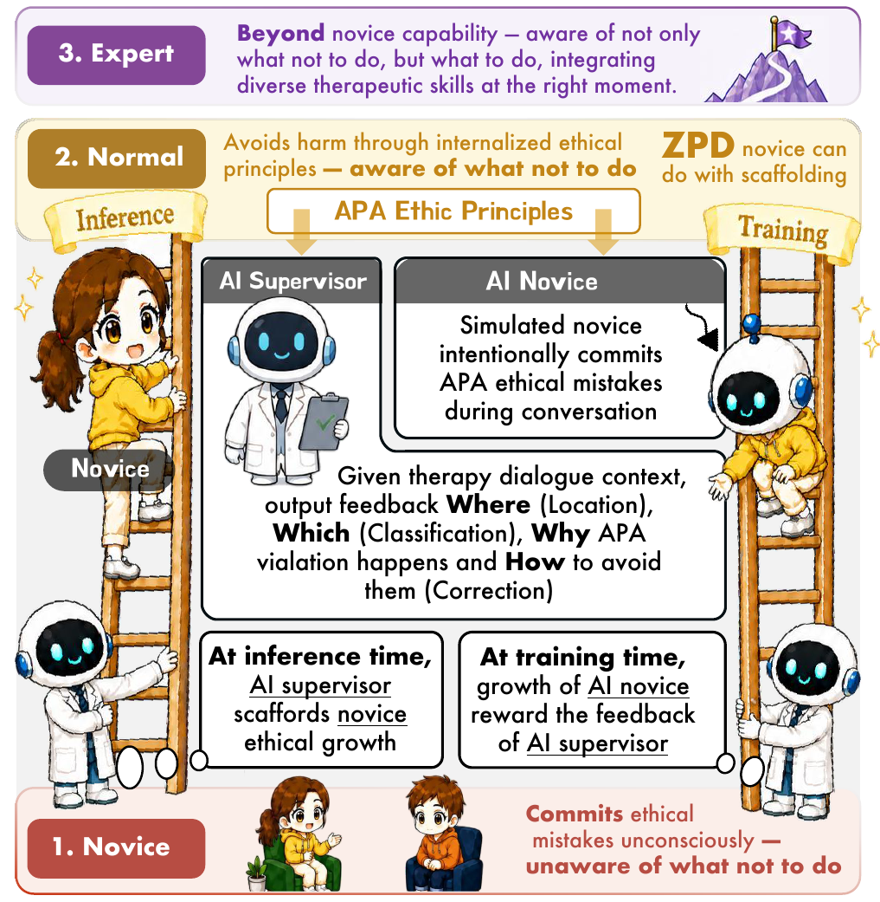
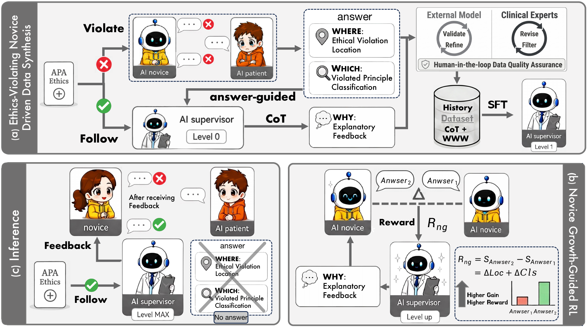
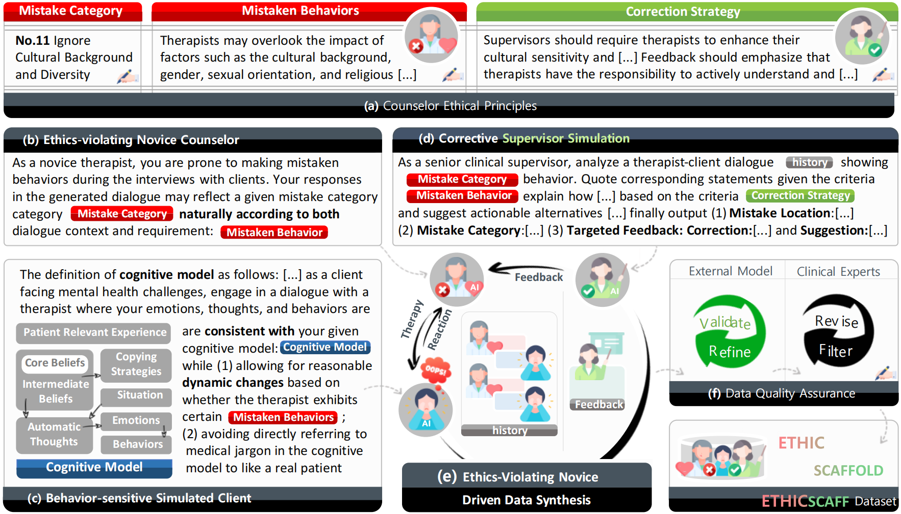
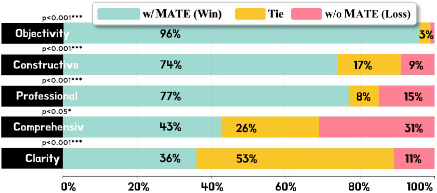
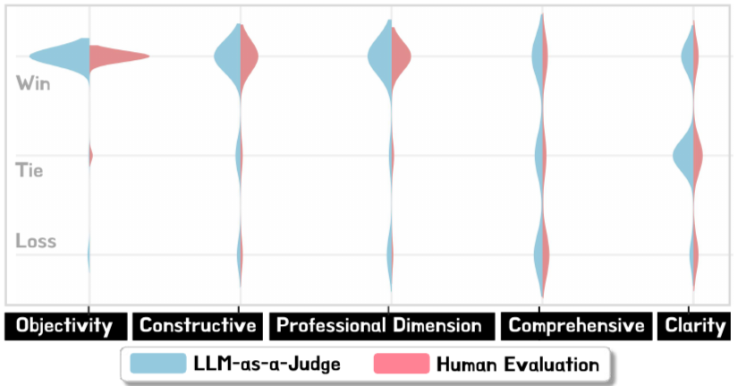
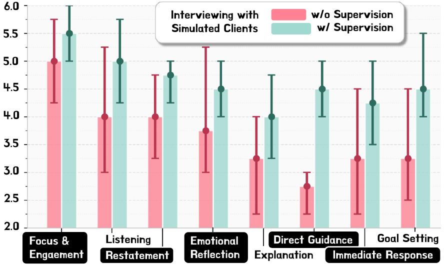

<div align='center'>

# First, Do No Harm

### AI Supervisor Scaffolds Novice Growth in Counselor Education

[[Paper](https://arxiv.org/pdf/2508.09042)] · [[Project Page](https://mmmdy.github.io/first-do-no-harm.github.io/)]

An ethics-first AI supervisor that helps novice counselors recognize subtle ethical violations, understand their risks, and learn safer responses through structured feedback.

</div>

---

## Overview

Large language models are increasingly explored as mental-health assistants, yet direct patient-facing deployment remains ethically and clinically fragile. **First, Do No Harm** instead positions AI as an educational supervisor for novice counselors. Given a counselor–client dialogue, the supervisor provides a structured learning scaffold:

- **WHERE** — locate the counselor utterance containing an ethical violation;
- **WHICH** — identify the violated professional principle or mistake category;
- **WHY** — explain the potential harm and provide actionable, non-judgmental guidance.

The supervisor is designed to support learning rather than replace licensed clinicians or human supervision.

<p align='center'>
  
</p>

## Highlights

- **Do No Harm supervision task:** jointly models ethical-violation location, violated-principle classification, and explanatory feedback.
- **EthicScaff:** a 9,915-instance human-in-the-loop dialogue–feedback dataset constructed from controlled novice mistakes and expert-informed ethical principles.
- **Validator-Guided Refinement:** improves feedback for progressivity, actionability, ethicality, and supportiveness.
- **Novice Growth Reward:** optimizes feedback according to whether a weaker novice improves after reading the explanation.
- **Multi-level evaluation:** covers objective ethical judgment, downstream counselor quality, expert assessment, and novice self-efficacy.

## Method

The framework is bidirectional: at inference time, the supervisor scaffolds novice ethical growth; during training, improvement in a weaker novice becomes a learning signal for the supervisor.

<p align='center'>
  
</p>

### Human-in-the-loop data construction

Clinical counselors and supervisors first define novice-relevant ethical principles. Controlled counselor and patient role-play then generates realistic conversations containing subtle, predefined mistakes. A supervisor produces targeted feedback, while validator-guided refinement and clinical-expert review ensure dataset quality.

<p align='center'>
  
</p>

## Repository contents

```text
.
├── assets/                         # Paper figures used in this README
├── code/
│   ├── data_gen_src/               # Dialogue synthesis and VGR
│   │   ├── agent_data_gen.py       # Controlled counselor–patient simulation
│   │   ├── vgr_refine.py           # Validator-Guided Refinement
│   │   ├── Datas/                   # Patient cases and mistake definitions
│   │   └── prompt/                  # Counselor, patient, and supervisor prompts
│   └── test_model_src/             # Inference and evaluation scripts
│       ├── mate_test_set_infer.py   # Supervisor inference
│       ├── mistake_type_classify.py # Principle classification
│       ├── mistake_classify_metric.py
│       └── counselor_eval/          # Downstream counselor self-play evaluation
└── dataset/
    ├── MATE_train_set_grpo_v5_partial.jsonl
    └── MATE_test_set_grpo_v5_partial.jsonl
```

## Partial data release

This repository currently includes **partial train and test samples** for inspecting the format and running small-scale checks. The paper reports results on the complete 9,915-instance EthicScaff dataset.

| File | Released samples | Main fields |
|---|---:|---|
| `MATE_train_set_grpo_v5_partial.jsonl` | 10 | messages, mistake label, dialogue history, novice prompts, novice result |
| `MATE_test_set_grpo_v5_partial.jsonl` | 10 | messages, mistake label, dialogue history, novice prompts, reference output |

Each record contains structured supervision information such as the dialogue history, mistake category, target output, and novice prompts before and after receiving an explanation.

## Environment

The code was developed for Python-based research workflows using OpenAI-compatible model endpoints and, optionally, locally served models through vLLM or Ollama.

```bash
python -m venv .venv

# Linux / macOS
source .venv/bin/activate

# Core dependencies
pip install openai pyautogen datasets tqdm numpy scikit-learn requests

# Evaluation dependencies
pip install bert-score rouge-chinese jieba nltk fire
```

For local GPU inference, install PyTorch and vLLM according to their official instructions for your CUDA environment.

## Usage guide

> [!IMPORTANT]
> These scripts are released from a research environment and retain experiment-specific endpoint and path placeholders. Before running an experiment, review the configuration block in the selected entry script and replace local model paths, API endpoints, prompt paths, and output paths. Never commit API keys.

### 1. Dialogue and supervision-data synthesis

The synthesis pipeline is implemented in:

```text
code/data_gen_src/agent_data_gen.py
```

Inspect its available arguments with:

```bash
python code/data_gen_src/agent_data_gen.py --help
```

The corresponding role prompts and source definitions are located in `code/data_gen_src/prompt/` and `code/data_gen_src/Datas/`.

### 2. Validator-Guided Refinement

Use `code/data_gen_src/vgr_refine.py` to validate and refine generated supervisory feedback. Configure an OpenAI-compatible endpoint and specify the input/output files in the script arguments or configuration block.

### 3. Supervisor training: SFT + Novice Growth-Guided GRPO

> [!NOTE]
> **Coming soon.** The SFT and GRPO training code, configuration files, and reproducible launch scripts are being organized and will be released in a future update.

The complete supervisor-training pipeline contains two stages:

1. **Supervised Fine-Tuning (SFT):** teaches the model to locate ethics-violating utterances, classify violated principles, and generate structured explanatory feedback using EthicScaff.
2. **Novice Growth-Guided GRPO:** further optimizes the supervisor using format, localization, classification, and Novice Growth rewards. The Novice Growth Reward measures whether a frozen weaker novice improves after reading the supervisor's explanation.


### 4. Supervisor inference and objective evaluation

The primary evaluation utilities are:

| Purpose | Entry point |
|---|---|
| Generate supervisor predictions | `code/test_model_src/mate_test_set_infer.py` |
| Violated-principle classification | `code/test_model_src/mistake_type_classify.py` |
| Few-shot classification | `code/test_model_src/mistake_type_classify_few_shot.py` |
| Classification and localization metrics | `code/test_model_src/mistake_classify_metric.py` |
| Text-quality metrics | `code/test_model_src/critic_predict_bleu.py`, `bertscore.py` |

### 5. Downstream counselor evaluation

Scripts under `code/test_model_src/counselor_eval/` simulate patient, counselor, and supervisor interactions and evaluate whether supervisory feedback improves subsequent counselor behavior. The included result folders are research artifacts and examples from the original experimental workflow.

## Main results

| Evaluation | Best reported result |
|---|---:|
| Violated-principle classification | **94.37% F1** with Qwen3-14B |
| Ethical-violation location | **74.24% F1** and **63.03% Jaccard** with Qwen3-8B |
| Downstream counseling quality | Improvements across all six clinical metrics |
| Novice self-efficacy | Significant gains across all eight assessed competencies |

<table>
  <tr>
    <td width='50%'></td>
    <td width='50%'></td>
  </tr>
  <tr>
    <td align='center'>Fine-tuned supervisory feedback wins across five professional criteria.</td>
    <td align='center'>Automatic and clinical-expert assessments show high agreement.</td>
  </tr>
</table>

<p align='center'>
  
</p>
<p align='center'>Self-efficacy of novice counselors before and after supervised feedback. Participants show significant gains across all eight assessed counseling competencies.</p>

## Responsible use

This repository supports research and low-stakes counselor education. It is **not** intended for autonomous therapy, diagnosis, crisis intervention, or replacement of licensed clinical supervision. Any use involving human learners should include qualified oversight, privacy protection, informed consent where applicable, and careful review of model-generated feedback.

## Citation

```bibtex
@article{xu2025first,
  title   = {First, Do No Harm: AI Supervisor Scaffolds Novice Growth in Counselor Education},
  author  = {Xu, Chen and Lyu, Zhenyu and Lan, Tian and Yi, Yang and Ji, Yu and Ji, Luyao and Shen, Jian and Wang, Zhihua and Cui, Leyang and Zhang, Jieshuo and Wan, Xiaohua and Dong, Qunxi and Yang, Minqiang and Wang, Juan and Liu, Xiuling and Hu, Bin},
  journal = {arXiv preprint arXiv:2508.09042},
  year    = {2025}
}
```

## Acknowledgment

If this repository is useful in your research, please cite the paper and link to the [project page](https://mmmdy.github.io/first-do-no-harm.github.io/).
